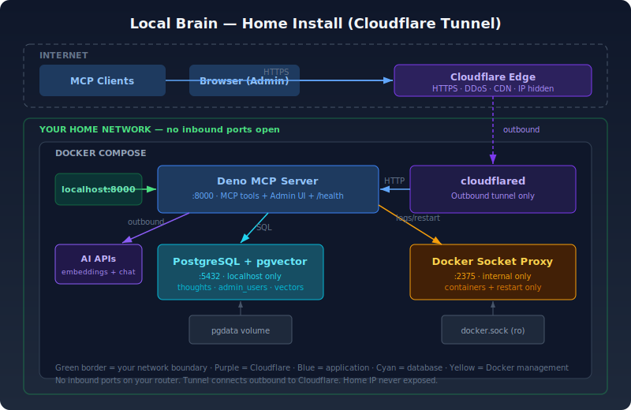
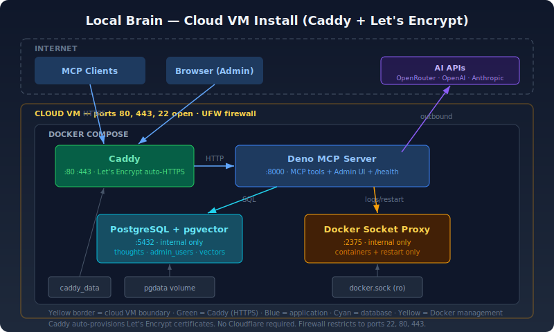

# Local Brain

A self-hosted fork of [OB1 (Open Brain)](https://github.com/NateBJones-Projects/OB1) that runs entirely on your own hardware. No Supabase, no cloud dependencies for data storage. Your brain stays on your machine.

## What This Is

A personal knowledge and memory layer that any MCP-compatible AI tool (Claude Code, Claude Desktop, Cursor, etc.) can read from and write to. One database, one server, accessible from anywhere via HTTPS.

Open Brain is cloud-first. Local Brain is yours-first. Same four MCP tools, same PostgreSQL + pgvector foundation, but the data never leaves your house.

Based on the OB1 Kubernetes self-hosted variant, simplified for a single-machine Docker Compose deployment.

## Prerequisites

### Hardware (minimum)

- Any x86_64 or ARM64 Linux machine (Raspberry Pi 4+, old laptop, NUC, desktop, VM)
- 1 GB RAM available (PostgreSQL + Deno server + tunnel are lightweight)
- 1 GB disk space (grows slowly — thoughts are small, embeddings are ~6KB each)

### Hardware (recommended)

- 2+ GB RAM
- SSD (faster vector search on large datasets)
- Always-on machine (so your MCP tools can always reach it)

### Operating System

- **Linux** — Ubuntu 20.04+, Debian 11+, Fedora 38+, or any distro with a modern kernel
- **macOS** — 12 Monterey or later (Docker Desktop)
- **Windows** — 10/11 with WSL2 (Docker Desktop)
- Kernel 4.x+ required (for Docker and pgvector)

### Software

- **Git** — to clone the repo (`sudo apt install git` / `brew install git`)
- **Docker Engine 20.10+** and **Docker Compose v2** — everything else runs in containers
  - Linux install: https://docs.docker.com/engine/install/
  - Mac/Windows: Docker Desktop includes both
  - Verify: `docker --version` and `docker compose version`
- **openssl** — for generating secrets (pre-installed on most systems)
- **curl** — for testing (pre-installed on most systems)

### External Accounts (free tiers work)

- **AI provider** (pick one):
  - [OpenRouter](https://openrouter.ai) — simplest, one key for everything (~$5 credits lasts months)
  - [OpenAI](https://platform.openai.com) — direct, no middleman
  - [Anthropic](https://console.anthropic.com) — for Claude-based metadata extraction (can mix with OpenAI embeddings)
- **Cloudflare** (for remote access only — skip if localhost-only):
  - Free account at [cloudflare.com](https://cloudflare.com)
  - A domain name with DNS managed by Cloudflare
- **MCP client** (what connects to Local Brain):
  - Claude Code, Claude Desktop, Cursor, or any MCP-compatible tool

## Architecture

### Home Install (Cloudflare Tunnel)



### Cloud Install (Caddy + Let's Encrypt)



## Stack

- **PostgreSQL 16** with pgvector extension — stores thoughts with vector embeddings
- **Deno 2.x** — runs the MCP server and admin panel (~server-side rendered, no build step)
- **Cloudflare Tunnel** — secure access without exposing your home IP
- **Docker Compose** — orchestrates four services (database, MCP server, tunnel, Docker socket proxy)

## Dependencies (pinned)

- `hono@4.9.2` — web framework (mature, stable)
- `zod@4.1.13` — validation
- `@modelcontextprotocol/sdk@1.24.3` — MCP protocol (moderate risk — protocol still maturing)
- `@hono/mcp@0.1.1` — Hono-to-MCP bridge (pre-1.0, small surface area)
- `postgres@v0.19.3` — Deno PostgreSQL driver (mature)
- `bcrypt@v0.4.1` — password hashing for admin panel
- `jose@5.9.6` — JWT signing/verification for admin sessions

## Security

- Access key authentication (shared secret over HTTPS)
- Cloudflare Tunnel — outbound-only connection, no inbound ports, home IP hidden
- PostgreSQL only listens on localhost (not exposed to internet)
- No cloud data storage — everything stays on your machine

## Admin Panel

A built-in web dashboard for managing your Local Brain instance:

- **Dashboard** — thought count, type breakdown, top topics, service health
- **Thoughts browser** — paginated, filterable view of all captured thoughts
- **Configuration editor** — view/edit `.env` with masked secrets, restart services
- **Log viewer** — Docker container logs for every service
- **Service restarts** — restart containers from the UI

Access at `http://localhost:8000/admin` (local-only by default). See [ADMIN.md](ADMIN.md) for setup.

## Hosting Options

### Home machine (recommended)

Run on a computer in your house. Your data never leaves your network. Use a Cloudflare Tunnel for secure remote access without exposing your IP.

- [HOME-HOSTING.md](HOME-HOSTING.md) — overview of home hosting approaches
- [CLOUDFLARE-TUNNEL.md](CLOUDFLARE-TUNNEL.md) — recommended home setup

### Cloud VM

Run on a Linode, DigitalOcean, Hetzner, or AWS EC2 instance. Caddy handles HTTPS via Let's Encrypt. Simpler networking, but your data lives on someone else's server.

- [CLOUD-HOSTING.md](CLOUD-HOSTING.md) — full cloud setup guide with firewall, Caddy, and security checklist

## Setup

See [SETUP.md](SETUP.md) for step-by-step installation instructions.

## Usage

Once Local Brain is running and connected to an MCP client, you use it by talking to your AI. There's no app to open, no interface to learn. You just say things.

### Capturing thoughts

Tell your AI to remember something. It captures the thought, generates an embedding, and extracts metadata automatically.

```
Remember that the API redesign should use versioned endpoints.
```
```
Capture this: met with Sarah about the Q3 roadmap. She wants to prioritize mobile.
```
```
Save a thought: the Tailwind approach is cleaner than custom CSS for the admin panel.
```

You don't need to use specific commands. Any MCP-connected AI will recognize that you want to capture something and call the `capture_thought` tool.

### Searching

Ask about something you've captured before. Search is semantic — it matches meaning, not exact words.

```
What did I say about the API redesign?
```
```
What were my notes from meetings with Sarah?
```
```
Search my thoughts about mobile.
```

### Listing and filtering

```
Show me my recent thoughts.
```
```
What tasks have I captured this week?
```
```
List all thoughts about people.
```

### Stats

```
Give me a summary of my thought stats.
```

### Where This Shines: Mobile

Local Brain was built from a phone. It's designed to be used from one.

**Claude Code with Remote MCP** — Connect Claude Code to your Local Brain URL as a remote MCP server. Then use Claude Code from any device — laptop, phone (via Claude mobile app or remote connection tools), tablet. Your brain is always reachable.

**Claudegram / Telegram bots** — If you run an AI agent on Telegram (like the one that built this project), connect it to Local Brain via MCP. Now you can capture and search thoughts from a Telegram chat while you're on a walk, at the grocery store, or working on a trailer.

**Claude Desktop** — Add Local Brain to your `claude_desktop_config.json`. Every conversation has access to your captured knowledge.

**Cursor / other MCP clients** — Any tool that supports MCP over HTTP can connect. Your coding assistant remembers what you told it last week.

The pattern is the same everywhere: your AI tools talk to one brain, and that brain runs on your hardware. You capture a thought from your phone at lunch, and your laptop IDE can find it that afternoon. One brain, many clients, your data.

### Tips

- **Capture liberally.** Thoughts are cheap (~$0.001 per thought in API costs). The semantic search means you don't need to organize anything — just capture and the AI will find it later.
- **Don't worry about formatting.** The metadata extraction handles categorization. Say "meeting with Jake about pricing, he wants to go lower" and the system tags it with people (Jake), topics (pricing, meeting), and type (observation).
- **Use it as a second brain for your AI.** Tell your AI to capture things during work sessions: "Remember that we decided to use Caddy instead of Nginx." Next time you ask about the project, the AI can search your thoughts and pick up where you left off.
- **Check the admin panel.** Visit `http://localhost:8000/admin` to browse everything visually, filter by type or topic, and verify what's being captured.

## Specs

The `specs/` directory contains detailed documentation of what was built and how it works. Useful for contributors, AI agents, and anyone who wants to understand the system before modifying it:

- [specs/architecture.md](specs/architecture.md) — system architecture, services, routing, database schema, file structure
- [specs/mcp-tools.md](specs/mcp-tools.md) — the four MCP tools, authentication, metadata extraction
- [specs/admin-panel.md](specs/admin-panel.md) — admin UI, auth flow, pages, Docker proxy integration
- [specs/environment.md](specs/environment.md) — all environment variables and provider configuration
- [specs/security.md](specs/security.md) — threat model, auth layers, permissions, known limitations

## Roadmap

- **Thought connections / graph view** — auto-link thoughts by embedding similarity, visualize clusters in the admin panel
- **Scheduled digests** — daily/weekly summaries of captured thoughts via email or webhook
- **Thought expiration and archiving** — optional TTL, auto-archive old scratch thoughts, keep search fast
- **Import/export** — bring in notes from Apple Notes, Obsidian, markdown, CSV. Export everything. No lock-in.
- **Multi-user with isolated brains** — per-user namespaces, separate MCP keys, shared instance

See [CONTRIBUTING.md](CONTRIBUTING.md) if any of these interest you.

## Contributing

Pull requests are welcome. See [CONTRIBUTING.md](CONTRIBUTING.md) for guidelines, design principles, and what we look for in PRs. The specs above are designed to give both humans and AI tools enough context to make good changes.

## Upstream

Forked from: https://github.com/NateBJones-Projects/OB1
License: FSL-1.1-MIT (see upstream repo)
